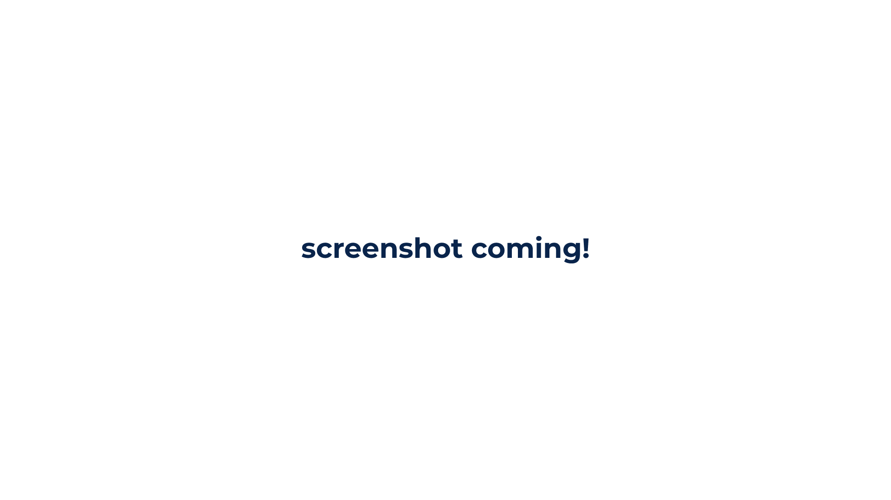

# Getting Started

## Terminology
Some key terminology is used throughout the web builder to avoid confusion. Here are some of the important ones:
 - **Project**: A project is a collection of configs with an attached name, author, icon and additional metadata that can be exported into a mod.
 - **Config**: A collection of values that aligns with a schema. *Note: it may be tempting to define a config as a single object in the game, but some schemas allow the creation of multiple objects.*
 - **Project Location/Project Source**: Where and how Sapiens Web Builder saves your project. This affects things like auto-save, asset support and whether they can be transferred from computer to computer, and survive browser clears.

## Creating a project

To get started, head over to the [Projects page](/projects) and select 
 New Project <svg xmlns="http://www.w3.org/2000/svg" viewBox="0 0 20 20" fill="currentColor" aria-hidden="true" class="-mr-0.5 ml-1.5 h-5 w-5"><path d="M10.75 4.75a.75.75 0 00-1.5 0v4.5h-4.5a.75.75 0 000 1.5h4.5v4.5a.75.75 0 001.5 0v-4.5h4.5a.75.75 0 000-1.5h-4.5v-4.5z"></path></svg>
. Next, enter a project name and storage location. 
IndexedDB Storage
 is recommended for new users, as it supports autosave and assets.

### Home page

The homepage of your project has some very important, global configuration. You can load more schemas in (if you're creating configs for a mod), or configure your project's metadata. 
#### Name
The visible name for your project, used both when selecting a project and exporting.
#### Version
The current version for your project. This value is automatically incremented and maintained by Sapiens Web Builder, but it can overriden if needed. 